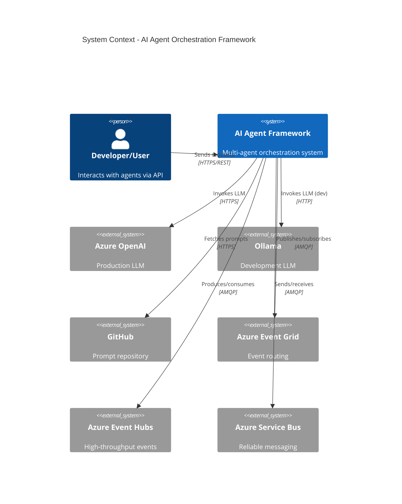
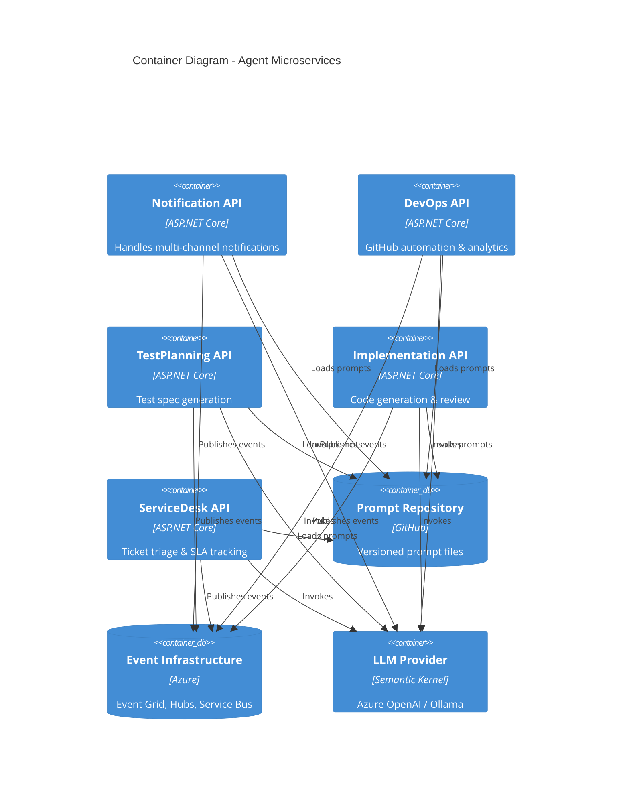
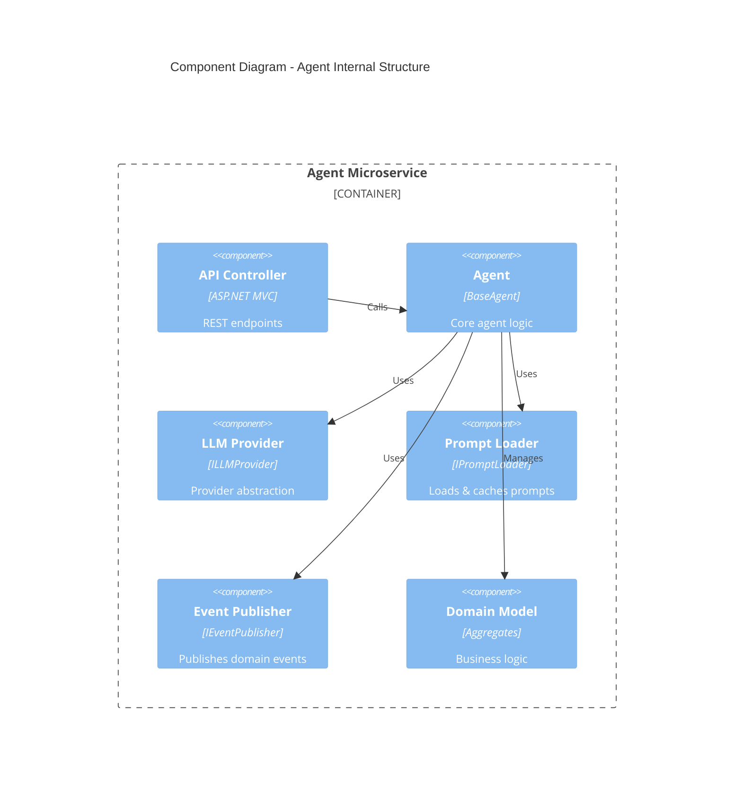
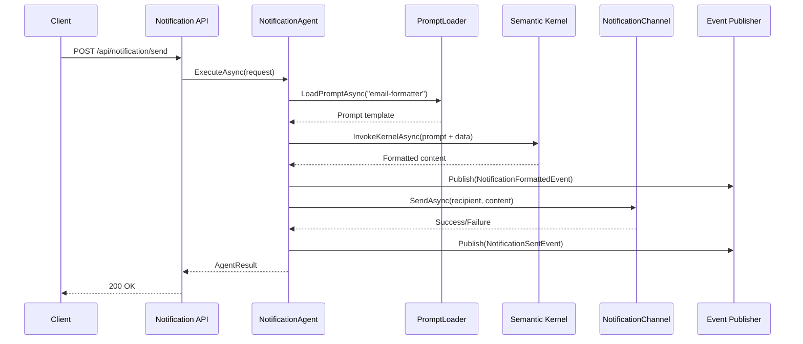
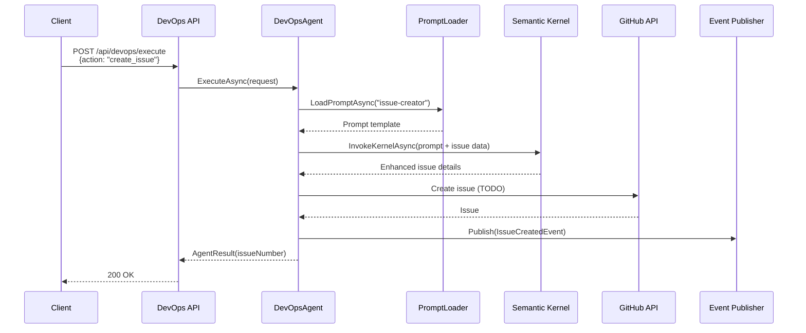
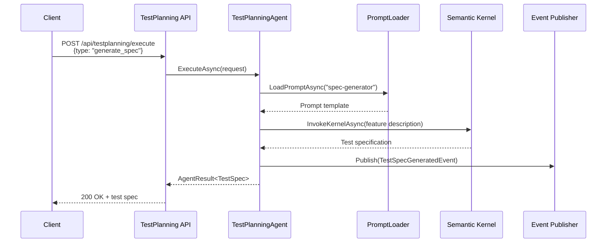
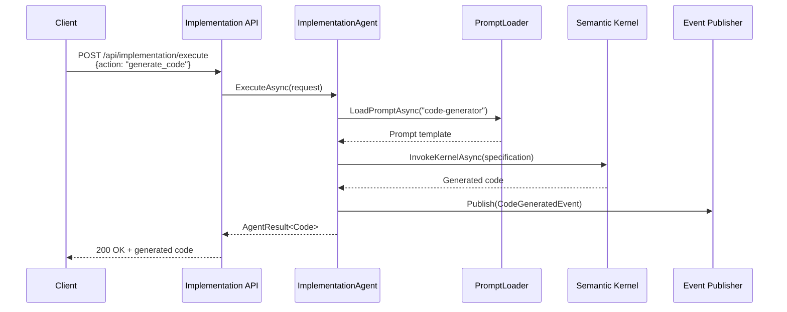
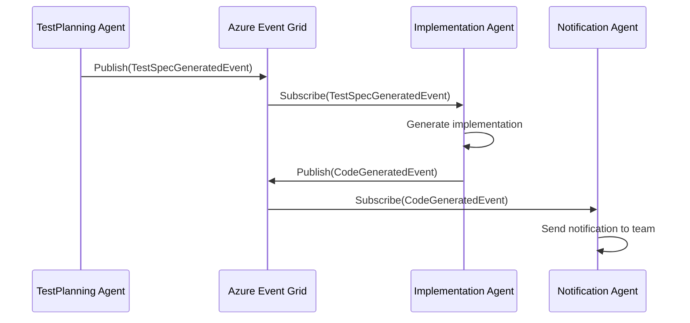

# AI Orchestration Multi-Agent Framework

An event-driven microservice framework for AI agent orchestration using C#, Microsoft Semantic Kernel, and Azure services.

## 🎯 Overview

This framework provides a production-ready, clean architecture implementation of AI agents that can:
- Process events from Azure Event Grid, Event Hubs, and Service Bus
- Execute LLM-powered operations via Azure OpenAI or Ollama
- Communicate via REST APIs with full Swagger documentation
- Scale independently in Azure Kubernetes Service (AKS)
- Load and execute versioned prompts from GitHub repositories

## 🏗️ Architecture

### C4 Context Diagram



### C4 Container Diagram



### C4 Component Diagram - Agent Structure



## 🔄 Agent Workflows

### Notification Agent Sequence



### DevOps Agent Sequence



### Test Planning Agent Sequence



### Implementation Agent Sequence



### Inter-Agent Event Flow



## Getting Started

### Prerequisites

- .NET 8 SDK or later
- Docker Desktop
- Azure CLI (for Azure deployment)
- Ollama (for local development)
- kubectl (for Kubernetes)

### Local Development Setup

1. **Clone the repository**
   ```powershell
   git clone <repository-url>
   cd my-agents
   ```

2. **Install Ollama**
   ```powershell
   # Download from https://ollama.ai
   ollama pull llama3.1
   ```

3. **Configure application settings**
   ```powershell
   cp src/Presentation/Agents.API.Gateway/appsettings.json src/Presentation/Agents.API.Gateway/appsettings.Development.json
   # Edit appsettings.Development.json to use Ollama
   ```

4. **Build the solution**
   ```powershell
   dotnet build
   ```

5. **Run tests**
   ```powershell
   dotnet test
   ```

6. **Run locally**
   ```powershell
   dotnet run --project src/Presentation/Agents.API.Gateway
   ```

### Azure Deployment

1. **Deploy infrastructure**
   ```powershell
   az login
   cd infrastructure/bicep
   az deployment sub create --location eastus --template-file main.bicep --parameters @parameters/dev.parameters.json
   ```

2. **Build and push containers**
   ```powershell
   # See deployment documentation
   ```

3. **Deploy to AKS**
   ```powershell
   kubectl apply -k k8s/overlays/dev
   ```

## Project Structure

```
├── src/
│   ├── Domain/              # Core business logic
│   ├── Application/         # Use cases and orchestration
│   ├── Infrastructure/      # External integrations
│   ├── Presentation/        # APIs
│   └── Shared/             # Cross-cutting concerns
├── prompts/                # Agent prompt files
├── infrastructure/         # IaC (Bicep/Terraform)
├── k8s/                   # Kubernetes manifests
├── tests/                 # Tests
└── docs/                  # Documentation
```

## Configuration

### LLM Provider Switching

Toggle between Ollama (development) and Azure OpenAI (production) via `appsettings.json`:

```json
{
  "LLMProvider": {
    "Type": "Ollama"  // or "AzureOpenAI"
  }
}
```

## 🚀 Features

### Core Capabilities
- **5 Specialized Agents**: Notification, DevOps, TestPlanning, Implementation, ServiceDesk
- **Event-Driven Architecture**: Azure Event Grid, Event Hubs, Service Bus integration
- **Prompt-Driven**: All agent logic configured via versioned prompt files
- **Dual LLM Support**: Azure OpenAI (production) and Ollama (development)
- **REST APIs**: Full Swagger documentation for all endpoints
- **Health Checks**: Kubernetes-ready liveness/readiness probes
- **Clean Architecture**: Strict separation of concerns (Domain, Application, Infrastructure, Presentation)
- **Comprehensive Testing**: Unit tests with 100% pass rate

### Agent Capabilities

| Agent | Purpose | Key Features |
|-------|---------|-------------|
| **Notification** | Multi-channel notifications | Email, SMS, Teams, Slack formatters with delivery tracking |
| **DevOps** | GitHub automation | Issue creation, sprint analytics, workflow triggering |
| **TestPlanning** | Test generation | Test spec generation, strategy planning, coverage analysis |
| **Implementation** | Code generation | Code generation, review, refactoring suggestions |
| **ServiceDesk** | Ticket management | Triage, solution suggestions, SLA tracking, escalation |

## 🛠️ Technology Stack

### Core Technologies
- **.NET 9**: Latest C# features and performance improvements
- **Microsoft Semantic Kernel 1.67.1**: LLM orchestration framework
- **ASP.NET Core**: REST API hosting
- **Swashbuckle 10.0**: OpenAPI/Swagger documentation

### Azure Services
- **Azure OpenAI**: Production LLM
- **Azure Event Grid**: Event routing and delivery
- **Azure Event Hubs**: High-throughput event streaming
- **Azure Service Bus**: Reliable message queuing
- **Azure Kubernetes Service (AKS)**: Container orchestration

### Development
- **Ollama**: Local LLM for development
- **xUnit**: Unit testing framework
- **Moq 4.20**: Mocking framework
- **FluentAssertions 8.8**: Assertion library

## 📁 Project Structure

```
my-agents/
├── src/
│   ├── Application/           # Application layer (agents, CQRS)
│   │   ├── Agents.Application.Core/
│   │   ├── Agents.Application.Notification/
│   │   ├── Agents.Application.DevOps/
│   │   ├── Agents.Application.TestPlanning/
│   │   ├── Agents.Application.Implementation/
│   │   └── Agents.Application.ServiceDesk/
│   ├── Domain/                # Domain layer (entities, events)
│   │   ├── Agents.Domain.Core/
│   │   └── Agents.Domain.*/
│   ├── Infrastructure/        # Infrastructure layer
│   │   ├── Agents.Infrastructure.LLM/
│   │   ├── Agents.Infrastructure.Prompts/
│   │   ├── Agents.Infrastructure.EventGrid/
│   │   ├── Agents.Infrastructure.EventHub/
│   │   └── Agents.Infrastructure.ServiceBus/
│   └── Presentation/          # API layer
│       ├── Agents.API.Notification/
│       ├── Agents.API.DevOps/
│       ├── Agents.API.TestPlanning/
│       ├── Agents.API.Implementation/
│       └── Agents.API.ServiceDesk/
├── tests/
│   └── Agents.Tests.Unit/     # Unit tests (24 tests, 100% pass)
├── prompts/                   # Versioned prompt files
└── infrastructure/            # IaC (Bicep/Terraform)
```

## 🏃 Getting Started

### Prerequisites
- .NET 9 SDK
- Ollama (for local development) or Azure OpenAI credentials
- Docker (optional, for containerization)

### Configuration

1. **Clone the repository**
```bash
git clone <repository-url>
cd my-agents
```

2. **Configure LLM Provider**

Edit `appsettings.json` in any API project:

```json
{
  "LLMProvider": {
    "ProviderType": "Ollama",  // or "AzureOpenAI"
    "Ollama": {
      "Endpoint": "http://localhost:11434",
      "ModelId": "llama3.2"
    },
    "AzureOpenAI": {
      "Endpoint": "https://your-openai.openai.azure.com",
      "ApiKey": "your-api-key",
      "DeploymentName": "gpt-4",
      "ModelId": "gpt-4"
    }
  }
}
```

3. **Build the solution**
```bash
dotnet build
```

4. **Run tests**
```bash
dotnet test
```

5. **Run an API**
```bash
# Run Notification API
cd src/Presentation/Agents.API.Notification
dotnet run

# Navigate to https://localhost:5001/swagger
```

### API Endpoints

Each agent exposes the following endpoints:

| Agent | Base URL | Execute Endpoint | Health Check |
|-------|----------|------------------|-------------|
| Notification | `:5001` | `POST /api/notification/send` | `GET /api/notification/health` |
| DevOps | `:5002` | `POST /api/devops/execute` | `GET /api/devops/health` |
| TestPlanning | `:5003` | `POST /api/testplanning/execute` | `GET /api/testplanning/health` |
| Implementation | `:5004` | `POST /api/implementation/execute` | `GET /api/implementation/health` |
| ServiceDesk | `:5005` | `POST /api/servicedesk/execute` | `GET /api/servicedesk/health` |

### Example Request

```bash
curl -X POST https://localhost:5001/api/notification/send \
  -H "Content-Type: application/json" \
  -d '{
    "channel": "email",
    "recipient": "user@example.com",
    "subject": "Test Notification",
    "content": "This is a test message"
  }'
```

## 🧪 Testing

### Unit Tests
Run all unit tests:
```bash
dotnet test tests/Agents.Tests.Unit/Agents.Tests.Unit.csproj
```

### Integration Tests
Integration tests use Testcontainers (requires Docker):
```bash
dotnet test tests/Agents.Tests.Integration/Agents.Tests.Integration.csproj
```

**Test Coverage:**
- Unit tests: 24 tests, 100% pass rate
- Integration tests: 8 tests for SQL Server persistence
- Technologies: xUnit, Moq, FluentAssertions, Testcontainers

## 📊 Status

| Phase | Status | Description |
|-------|--------|-------------|
| Phase 1 | ✅ Complete | Foundation (Domain, Entities, Interfaces) |
| Phase 2 | ✅ Complete | Event Infrastructure (Event Grid, Hubs, Service Bus) |
| Phase 3 | ✅ Complete | Prompt Management System |
| Phase 4 | ✅ Complete | Core Agents Implementation |
| Phase 5 | ✅ Complete | API Layer (REST APIs, Swagger, Health Checks) |
| Phase 6 | 🚧 In Progress | Persistence Layer (Cosmos DB, Azure SQL) |
| Phase 7 | ⏳ Planned | Infrastructure as Code (Bicep/Terraform) |
| Phase 8 | ⏳ Planned | Kubernetes Deployment (Dockerfiles, Helm) |
| Phase 9 | ⏳ Planned | Observability (Logging, Metrics, Tracing) |
| Phase 10 | ⏳ Planned | Integration Testing |

## Contributing

See [CONTRIBUTING.md](CONTRIBUTING.md) for details on how to contribute to this project.

## Documentation

- [Architecture Overview](docs/architecture.md)
- [Agent Development Guide](docs/agent-development.md)
- [Prompt Authoring Guide](docs/prompt-authoring.md)
- [Deployment Guide](docs/deployment.md)
- [Operations Runbook](docs/operations.md)

## License

MIT License - see [LICENSE](LICENSE) for details.

## Support

For issues and questions, please open a GitHub issue.
