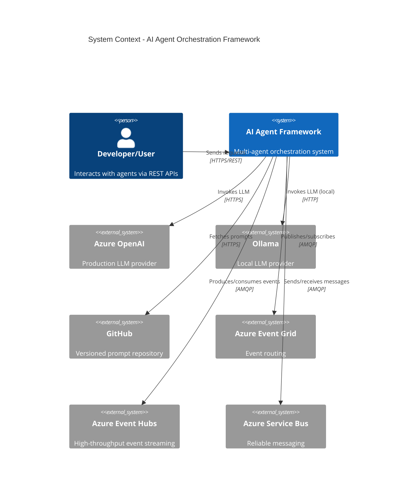
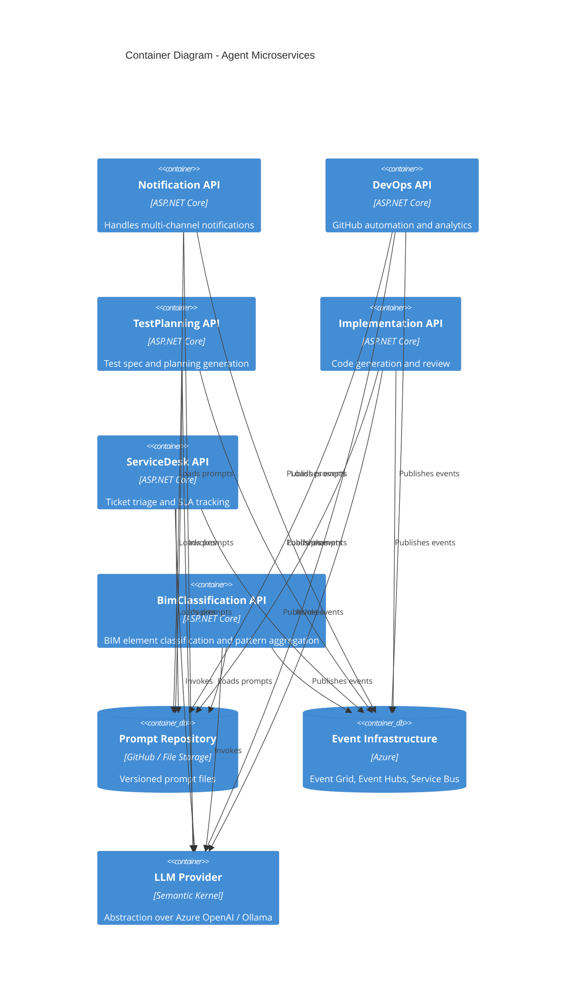
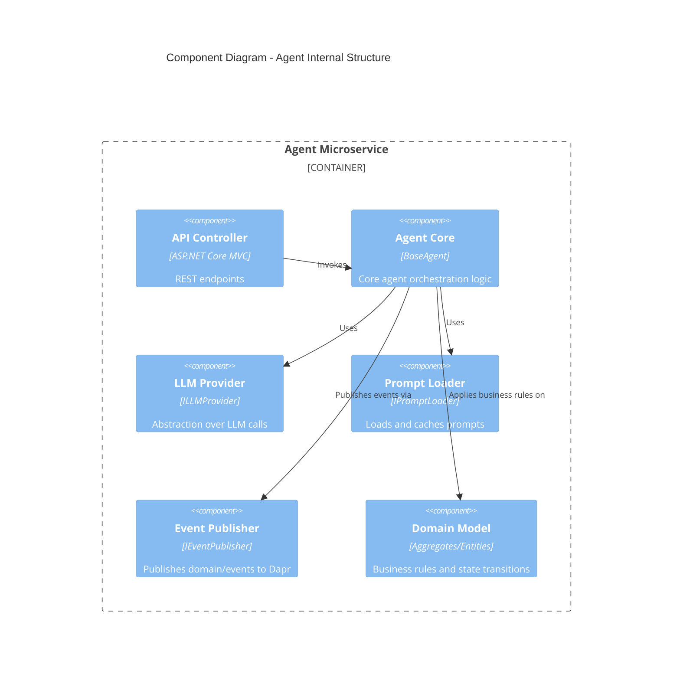
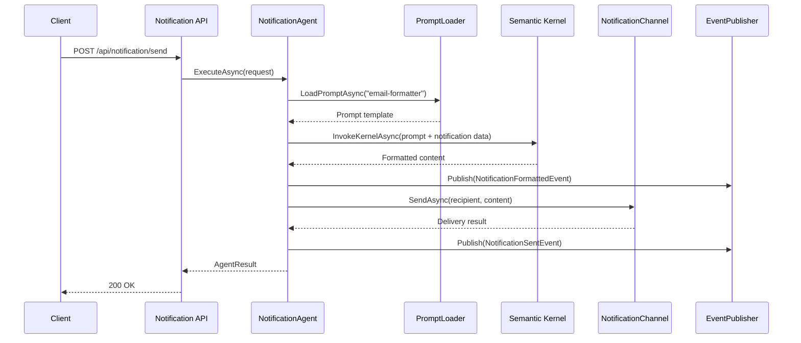
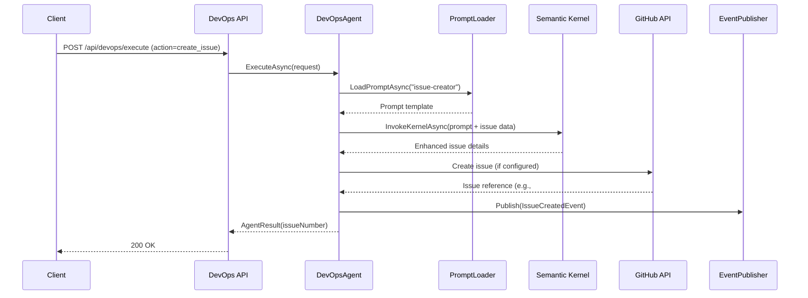
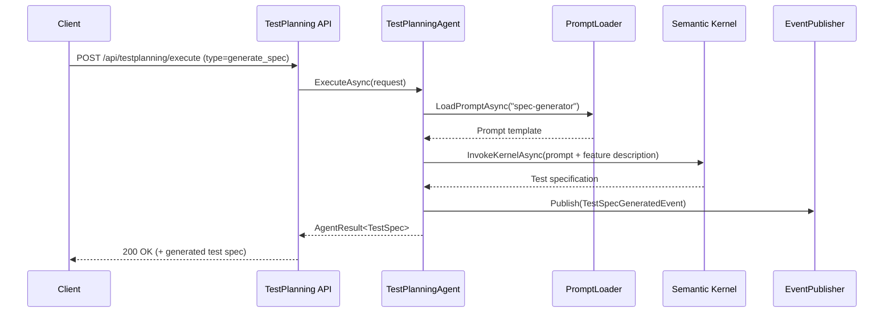
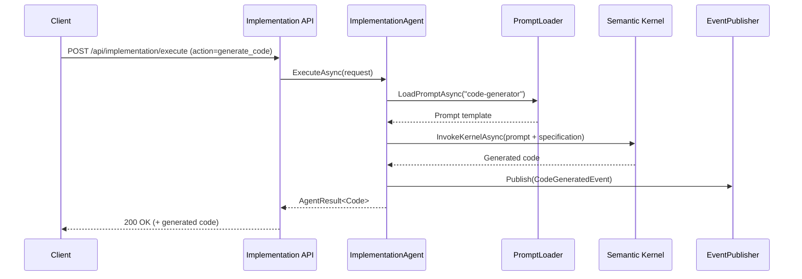
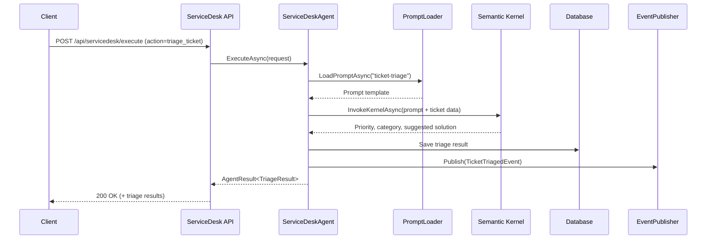
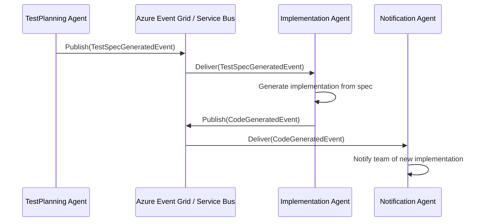

# AI Orchestration Multi-Agent Framework

An event-driven microservice framework for AI agent orchestration using C#, Microsoft Semantic Kernel, Dapr, .NET Aspire, and Azure services.

---

## Table of Contents

1. [Overview](#overview)
2. [Key Capabilities](#key-capabilities)
3. [Getting Started](#getting-started)
   - [Prerequisites](#prerequisites)
   - [Quick Start with .NET Aspire (Recommended)](#quick-start-with-net-aspire-recommended)
   - [Running APIs Individually](#running-apis-individually)
   - [Azure Deployment (High-Level)](#azure-deployment-high-level)
4. [Architecture](#architecture)
   - [C4 Context Diagram](#c4-context-diagram)
   - [C4 Container Diagram](#c4-container-diagram)
   - [C4 Component Diagram - Agent Structure](#c4-component-diagram---agent-structure)
5. [Agent Workflows](#agent-workflows)
   - [Notification Agent Sequence](#notification-agent-sequence)
   - [DevOps Agent Sequence](#devops-agent-sequence)
   - [Test Planning Agent Sequence](#test-planning-agent-sequence)
   - [Implementation Agent Sequence](#implementation-agent-sequence)
   - [Service Desk Agent Sequence](#service-desk-agent-sequence)
   - [BIM Classification Agent Sequence](#bim-classification-agent-sequence)
   - [Inter-Agent Event Flow](#inter-agent-event-flow)
6. [Features](#features)
7. [Technology Stack](#technology-stack)
8. [Project Structure](#project-structure)
9. [Configuration](#configuration)
   - [LLM Provider Configuration](#llm-provider-configuration)
10. [API Endpoints](#api-endpoints)
11. [Testing](#testing)
12. [Deployment](#deployment)
13. [Status](#status)
14. [Contributing](#contributing)
15. [Documentation](#documentation)
16. [License](#license)
17. [Support](#support)

---

## Overview

This framework provides a production-oriented, clean-architecture implementation of AI agents built on .NET. It is designed to:

- Orchestrate **multiple specialized agents** (Notification, DevOps, Test Planning, Implementation, Service Desk, BIM Classification)
- Run as **independent microservices** with clear boundaries
- Process events via **Azure Event Grid, Event Hubs, and Service Bus** (through Dapr)
- Execute LLM-powered operations via **Azure OpenAI or Ollama**, abstracted through Microsoft Semantic Kernel
- Expose **REST APIs** with full Swagger/OpenAPI documentation
- Scale independently on **Azure Kubernetes Service (AKS)** or similar Kubernetes platforms
- Load and execute **versioned prompts** from GitHub or local prompt repositories

The goal: give you a pragmatic, opinionated starting point for building real, multi-agent production systems—not another toy sample.

---

## Key Capabilities

- **Multi-Agent Architecture**  
  Six specialized agents, each with its own API, domain model, and workflows: Notification, DevOps, Test Planning, Implementation, Service Desk, BIM Classification.

- **Event-Driven Microservices**  
  Dapr-based pub/sub with Azure Service Bus, Event Hubs, or Redis backing, enabling decoupled inter-agent communication.

- **LLM Abstraction**  
  Centralized LLM provider abstraction via Microsoft Semantic Kernel, supporting both Ollama (local dev) and Azure OpenAI (production).

- **.NET Aspire Integration**  
  One-command local orchestration: services, Dapr sidecars, databases, Redis, and observability all wired together.

- **Prompt-Driven Behavior**  
  Agent logic can be shaped by versioned prompts (stored in GitHub or `prompts/`), making behavior changes safer and auditable.

- **Production-Ready Concerns**  
  Health checks, structured logging, OpenTelemetry, readiness/liveness, IaC, Kubernetes manifests—already wired in as patterns.

---

## Getting Started

### Prerequisites

**Required:**

- **.NET 9 SDK**  
- **PowerShell 7+** (for scripts, if used)
- **Git** (for cloning and version control)

**For Local Orchestration / Containers:**

- **Docker Desktop** or **Rancher Desktop**
- **Dapr CLI** (if running Dapr outside Aspire)
- **Ollama** (optional, for local LLM dev)  
  or Azure OpenAI configuration if you want to test against cloud LLMs.

**For Azure Deployment (Optional):**

- **Azure CLI**
- **kubectl**
- Access to Azure subscription for AKS, Service Bus, Event Hubs, Cosmos DB, SQL, etc.

---

### Quick Start with .NET Aspire (Recommended)

This is the simplest way to bring the entire system up locally with observability baked in.

1. **Clone the repository**

   ```powershell
   git clone <repository-url>
   cd my-agents
   ```

2. **Ensure Docker is running**

   ```powershell
   docker ps
   ```

3. **Run the Aspire AppHost**

   ```powershell
   dotnet run --project src/AppHost/Agents.AppHost/Agents.AppHost.csproj
   ```

4. **Open the Aspire Dashboard**

   * Navigate to: `http://localhost:15000`
   * From the dashboard you can:
     * See all agent APIs, Dapr sidecars, and dependencies
     * View logs, traces, and metrics
     * Jump to service URLs (ports are often managed by Aspire and may not match static numbers)

**What this setup provides:**

* All agent APIs running with their Dapr sidecars
* Shared infrastructure (e.g. Redis, SQL Server/Ollama containers if configured)
* Unified observability (OpenTelemetry + Aspire Dashboard)
* Service discovery and health checks handled via Aspire

---

### Running APIs Individually

If you prefer to run a single service without Aspire:

1. **Clone the repository**

   ```powershell
   git clone <repository-url>
   cd my-agents
   ```

2. **Configure your LLM Provider**  
   See [LLM Provider Configuration](#llm-provider-configuration).

3. **Build the solution**

   ```powershell
   dotnet build
   ```

4. **Run tests** (optional but recommended)

   ```powershell
   dotnet test
   ```

5. **Run a specific API**

   Example: Notification API

   ```powershell
   dotnet run --project src/Presentation/Agents.API.Notification/Agents.API.Notification.csproj
   ```

   Then open Swagger (exact port may differ):
   * Default Kestrel: `https://localhost:<port>/swagger`

> **Note:** Ports shown in this README are illustrative. When running under Aspire or Kubernetes, check the Aspire dashboard or Ingress configuration for actual URLs and ports.

---

### Azure Deployment (High-Level)

The repo includes patterns for Azure deployment via IaC and Kubernetes.

Typical flow:

1. **Provision Infrastructure (Bicep/Terraform)**

   ```powershell
   az login
   cd infrastructure/bicep
   az deployment sub create `
     --location eastus `
     --template-file main.bicep `
     --parameters @parameters/dev.parameters.json
   ```

2. **Build and Push Containers**

   * Use your CI/CD pipeline or local `docker build` + `docker push`.
   * Target your container registry (ACR or other).

3. **Deploy to AKS**

   ```powershell
   kubectl apply -k k8s/overlays/dev
   ```

4. **Monitor**

   * Use Prometheus + Grafana (if wired in)
   * Use Azure Monitor / Application Insights (if configured)

See dedicated deployment docs (linked below) for details.

---

## Architecture

### C4 Context Diagram



---

### C4 Container Diagram



---

### C4 Component Diagram - Agent Structure



---

## Agent Workflows

### Notification Agent Sequence



---

### DevOps Agent Sequence



---

### Test Planning Agent Sequence



---

### Implementation Agent Sequence



---

### Service Desk Agent Sequence



---

### BIM Classification Agent Sequence

```mermaid
sequenceDiagram
    participant Client
    participant API as BimClassification API
    participant Agent as BimClassificationAgent
    participant Prompt as PromptLoader
    participant LLM as Semantic Kernel
    participant DB as Database
    participant Events as EventPublisher
    
    Client->>API: POST /api/bimclassification/execute (elementId, properties)
    API->>Agent: ExecuteAsync(request)
    Agent->>Prompt: LoadPromptAsync("bim-classifier")
    Prompt-->>Agent: Prompt template
    Agent->>LLM: InvokeKernelAsync(prompt + BIM element data)
    LLM-->>Agent: Classification suggestions
    Agent->>DB: Save suggestions (for review)
    Agent->>Events: Publish(ClassificationSuggestedEvent)
    Agent-->>API: AgentResult<Suggestions>
    API-->>Client: 200 OK (+ classification suggestions)
    
    Note over Agent,DB: Suggestions are advisory only; a human must approve before applying to production data.
```

---

### Inter-Agent Event Flow



---

## Features

### Core Capabilities

* **Specialized Agents**
  * Notification, DevOps, TestPlanning, Implementation, ServiceDesk, BimClassification
  * Each agent is an independent API and microservice, all following the same architectural pattern.

* **Event-Driven Architecture**
  * Uses Dapr pub/sub to connect agents via Azure Service Bus, Event Hubs, or Redis.
  * Agents communicate via events, not tight RPC coupling.

* **LLM-Agnostic via Semantic Kernel**
  * Unified abstraction over LLM calls with Microsoft Semantic Kernel.
  * Supports local dev via Ollama and production via Azure OpenAI.

* **.NET Aspire Orchestration**
  * Aspire AppHost coordinates microservices, Dapr sidecars, and dependencies.
  * Built-in distributed tracing, health checks, and dashboard.

* **Prompt-Driven Design**
  * All agent behaviors are shaped by prompt templates stored in a prompt repository (`prompts/` or GitHub).
  * Prompts can be versioned, reviewed, and changed independently of code.

* **Clean Architecture**
  * Strict separation of Domain, Application, Infrastructure, and Presentation.
  * Agents share common core patterns but keep their own domain logic.

* **BIM-Scale Design**
  * BIM Classification Agent is designed to handle large datasets (100M+ records) via pattern aggregation and multi-level caching.
  * Classification is advisory and human-in-the-loop by design.

* **Production-Ready Concerns**
  * Swagger/OpenAPI docs
  * Health endpoints for liveness/readiness
  * Structured logging (Serilog)
  * OpenTelemetry-based observability
  * IaC for Azure provisioning
  * Kubernetes manifests for AKS deployment

---

## Technology Stack

### Core

* **.NET 9** – latest C# features and runtime performance
* **ASP.NET Core** – high-performance web APIs
* **Microsoft Semantic Kernel (1.x)** – LLM orchestration and function calling

### Orchestration & Microservices

* **.NET Aspire 8+** – app composition, diagnostics, and local orchestration
* **Dapr (v1+)** – distributed application runtime for pub/sub, state, bindings
* **Redis** – local state store and pub/sub for development (optional)
* **Docker / Rancher Desktop** – container runtime for local and CI workloads

### Azure Integrations (Optional but Supported)

* **Azure OpenAI** – production-grade LLM endpoints
* **Azure Service Bus** – message broker for pub/sub via Dapr
* **Azure Event Hubs** – high-throughput event streaming
* **Azure Cosmos DB** – state store via Dapr components
* **Azure SQL Database** – relational storage
* **Azure Kubernetes Service (AKS)** – container orchestration

### Development & Testing

* **xUnit** – test framework
* **Moq** – mocking framework
* **FluentAssertions** – fluent, readable assertions
* **Testcontainers** – integration tests against real containers (SQL, etc.)

### Observability

* **OpenTelemetry** – tracing and metrics
* **Aspire Dashboard** – unified service view for local dev
* **Prometheus** – metrics collection and storage (optional)
* **Grafana** – metrics visualization (optional)
* **Serilog** – structured logging (console, sinks as configured)

---

## Project Structure

High-level layout:

```text
my-agents/
├── src/
│   ├── Domain/                      # Domain layer (entities, events, value objects)
│   │   ├── Agents.Domain.Core/
│   │   └── Agents.Domain.*          # Service-specific domain models
│   ├── Application/                 # Application layer (use cases, agents)
│   │   ├── Agents.Application.Core/             # Shared abstractions (BaseAgent, interfaces)
│   │   ├── Agents.Application.Notification/
│   │   ├── Agents.Application.DevOps/
│   │   ├── Agents.Application.TestPlanning/
│   │   ├── Agents.Application.Implementation/
│   │   ├── Agents.Application.ServiceDesk/
│   │   └── Agents.Application.BimClassification/
│   ├── Infrastructure/              # Integration with external systems
│   │   ├── Agents.Infrastructure.LLM/           # Semantic Kernel + LLM provider abstractions
│   │   ├── Agents.Infrastructure.Prompts/       # Prompt loading from GitHub/local
│   │   ├── Agents.Infrastructure.EventGrid/
│   │   ├── Agents.Infrastructure.EventHub/
│   │   └── Agents.Infrastructure.ServiceBus/
│   └── Presentation/                # API layer (ASP.NET Core endpoints)
│       ├── Agents.API.Notification/
│       ├── Agents.API.DevOps/
│       ├── Agents.API.TestPlanning/
│       ├── Agents.API.Implementation/
│       ├── Agents.API.ServiceDesk/
│       └── Agents.API.BimClassification/
├── AppHost/                         # .NET Aspire AppHost (if separated)
├── prompts/                         # Versioned prompt templates
├── tests/
│   ├── Agents.Tests.Unit/           # Unit tests for domain & application
│   └── Agents.Tests.Integration/    # Integration tests (Testcontainers, Dapr, persistence)
├── infrastructure/                  # IaC (Bicep/Terraform)
├── k8s/                             # Kubernetes manifests and overlays
└── docs/                            # Architecture, deployment, and ops documentation
```

Layers are wired to enforce clean architecture: Presentation → Application → Domain, with Infrastructure implementing interfaces defined in inner layers.

---

## Configuration

### LLM Provider Configuration

All LLM configuration is centralized under `LLMProvider` in `appsettings.json` (and environment-specific variants).

Example:

```json
{
  "LLMProvider": {
    "ProviderType": "Ollama",  // or "AzureOpenAI"
    "Ollama": {
      "Endpoint": "http://localhost:11434",
      "ModelId": "llama3.2"
    },
    "AzureOpenAI": {
      "Endpoint": "https://your-openai-resource.openai.azure.com",
      "ApiKey": "YOUR-API-KEY",
      "DeploymentName": "gpt-4o-agents",
      "ModelId": "gpt-4o"
    }
  }
}
```

**Behavior:**

* `ProviderType` determines which configuration block the infrastructure layer binds to.
* The LLM provider is typically injected via `ILLMProvider` into the Application layer.
* Semantic Kernel is configured to use either the Ollama HTTP endpoint or Azure OpenAI endpoint.

**Environment Overrides:**

* Use `appsettings.Development.json` for local Ollama.
* Use `appsettings.Production.json` or environment variables for Azure OpenAI.
* For Kubernetes/AKS, prefer Kubernetes Secrets + environment variable mapping for API keys.

---

## API Endpoints

Each agent exposes a consistent set of endpoints (exact routes may vary slightly per implementation).

Example pattern:

| Agent             | Base Path                | Primary Action Endpoint               | Health Endpoint                     |
| ----------------- | ------------------------ | ------------------------------------- | ----------------------------------- |
| Notification      | `/api/notification`      | `POST /api/notification/send`         | `GET /api/notification/health`      |
| DevOps            | `/api/devops`            | `POST /api/devops/execute`            | `GET /api/devops/health`            |
| TestPlanning      | `/api/testplanning`      | `POST /api/testplanning/execute`      | `GET /api/testplanning/health`      |
| Implementation    | `/api/implementation`    | `POST /api/implementation/execute`    | `GET /api/implementation/health`    |
| ServiceDesk       | `/api/servicedesk`       | `POST /api/servicedesk/execute`       | `GET /api/servicedesk/health`       |
| BimClassification | `/api/bimclassification` | `POST /api/bimclassification/execute` | `GET /api/bimclassification/health` |

Each API exposes **Swagger/OpenAPI**:

* Default dev URL: `https://localhost:<port>/swagger`
* Under Aspire, use the dashboard to navigate to each API's Swagger UI.

---

## Testing

The solution includes a layered test suite covering:

* **Domain Tests**
  * Entities, value objects, and domain services
  * Validation rules and invariants

* **Application Layer Tests**
  * Agent orchestration logic
  * Interaction with LLM provider abstractions, prompt loader, and event publisher
  * CQRS handlers (if present)

* **Infrastructure & Integration Tests**
  * LLM provider wiring (mocked in most cases)
  * Dapr pub/sub interaction, where feasible
  * Persistence behavior using Testcontainers (e.g., SQL Server, Redis)

* **Observability Tests**
  * Verification of basic metrics/tracing setup behavior (where meaningful)

### Running Tests

**All tests:**

```bash
dotnet test
```

**Unit tests only (example):**

```bash
dotnet test tests/Agents.Tests.Unit/Agents.Tests.Unit.csproj
```

**Integration tests only (requires Docker):**

```bash
dotnet test tests/Agents.Tests.Integration/Agents.Tests.Integration.csproj
```

The exact test counts will evolve as new agents and capabilities are added; the intent is that each new feature ships with unit tests at minimum, plus integration tests where external behavior matters.

---

## Deployment

### Local Development

* Prefer **.NET Aspire** for orchestrating agents, Dapr sidecars, and dependencies.
* Use the Aspire dashboard (`http://localhost:15000`) to:
  * Inspect service health and logs
  * Jump to Swagger for each service
  * View traces across services

### Azure / Kubernetes

Typical deployment flow:

1. **Infrastructure Provisioning**

   * Use `infrastructure/bicep` (or Terraform) to provision:
     * AKS cluster
     * Azure Service Bus / Event Hubs
     * Azure Cosmos DB / SQL
     * Azure OpenAI (if used)
     * Supporting resources (Key Vault, ACR, etc.)

2. **Container Image Build & Push**

   * Build each agent API and any supporting worker images.
   * Push to your container registry (ACR or other).

3. **Kubernetes Manifests**

   * Use `k8s/` base and overlays (e.g., `k8s/overlays/dev`) to:
     * Deploy agent services
     * Deploy Dapr sidecars (via annotations)
     * Configure secrets and config maps
     * Configure ingress (if needed)

   Example:

   ```bash
   kubectl apply -k k8s/overlays/dev
   ```

4. **Observability in Production**

   * Wire OpenTelemetry to send traces/metrics to:
     * Azure Monitor / Application Insights, and/or
     * Prometheus & Grafana
   * Configure dashboards for:
     * Request rates per agent
     * Error rates per agent
     * Latency & LLM call distribution

---

## Status

A suggested phase view for this framework (adapt to match reality):

| Phase   | Status                   | Description                                                 |
| ------- | ------------------------ | ----------------------------------------------------------- |
| Phase 1 | ✅ Complete / In Progress | Core domain and architecture foundations                    |
| Phase 2 | ✅ Complete / In Progress | Event infrastructure (Dapr components, pub/sub patterns)    |
| Phase 3 | ✅ Complete / In Progress | Prompt management system                                    |
| Phase 4 | ✅ Complete / In Progress | Core agents implementation (Notification, DevOps, etc.)     |
| Phase 5 | ✅ Complete / In Progress | API layer (REST, Swagger, health checks)                    |
| Phase 6 | ✅ Complete / In Progress | Persistence integration (Cosmos/SQL, repositories, queries) |
| Phase 7 | ✅ Complete / In Progress | IaC for Azure (Bicep/Terraform)                             |
| Phase 8 | ✅ Complete / In Progress | Kubernetes deployment (AKS manifests, CI/CD hooks)          |
| Phase 9 | ✅ Complete / In Progress | Observability (OpenTelemetry, dashboards)                   |

Update this table as the project moves.

---

## Contributing

Contributions are welcome.

Typical flow:

1. Fork the repository
2. Create a feature branch
3. Implement changes following:
   * Clean architecture boundaries
   * Existing coding patterns and conventions
   * Tests-first where possible
4. Run tests (`dotnet test`)
5. Open a Pull Request with:
   * Clear description of changes
   * Any relevant diagrams or new prompts
   * Notes on migration or configuration changes

See `CONTRIBUTING.md` (if present) for detailed guidelines.

---

## Documentation

Recommended doc files (some may already exist in `docs/`):

* `docs/architecture.md` – deeper dive into design decisions
* `docs/agent-development.md` – how to create/extend agents
* `docs/prompt-authoring.md` – guidance for writing and versioning prompts
* `docs/deployment.md` – detailed deployment instructions for Dev/Stage/Prod
* `docs/operations.md` – operations runbook, alerts, and SLO suggestions

---

## License

This project is licensed under the **MIT License**.
See [`LICENSE`](LICENSE) for details.

---

## Support

For issues, questions, or suggestions:

* Open a GitHub issue in the repository.
* Include:
  * Clear description of the problem or request
  * Steps to reproduce (if a bug)
  * Logs or configuration snippets where relevant (redact secrets)

This framework is intended as a solid foundation for building serious multi-agent systems—extend it, break it, and adapt it to your environment.
