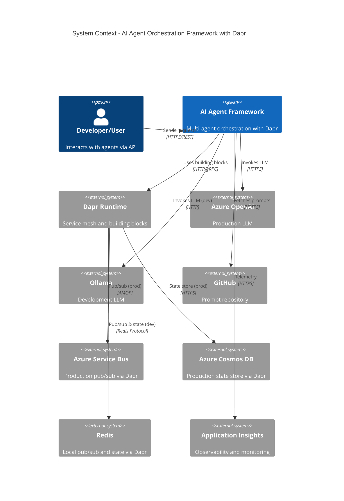
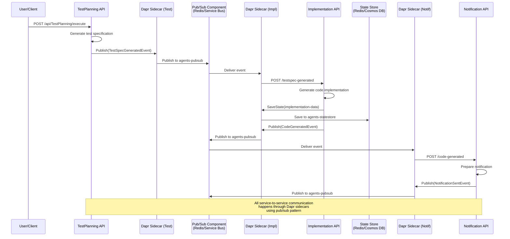
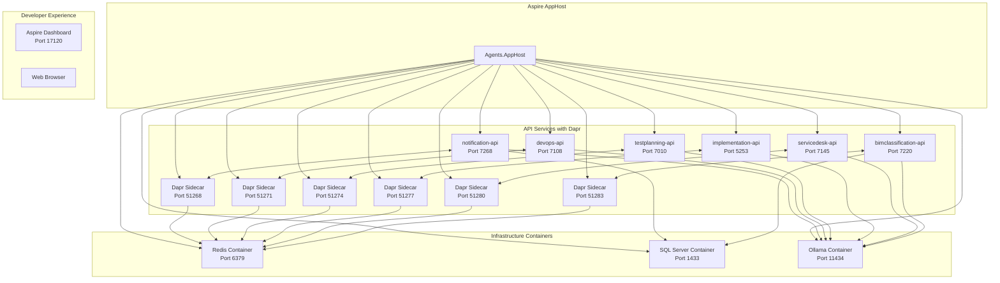

# Architecture Overview

This document provides a comprehensive overview of the AI Orchestration Multi-Agent Framework architecture, including design principles, layer structure, and key patterns.

## Table of Contents

- [Core Principles](#core-principles)
- [Architecture Style](#architecture-style)
- [System Context](#system-context)
- [Layer Structure](#layer-structure)
- [Event-Driven Architecture](#event-driven-architecture)
- [Warp Agents for Development](#warp-agents-for-development)
- [Local Development with Aspire](#local-development-with-aspire)
- [Agent Architecture](#agent-architecture)
- [Data Flow](#data-flow)
- [Design Patterns](#design-patterns)
- [Technology Decisions](#technology-decisions)

## Core Principles

The framework is built on eight fundamental principles:

1. **Clean Architecture**: Strict separation of concerns with clear boundaries between Domain, Application, Infrastructure, and Presentation layers
2. **Event-Driven**: Agents communicate asynchronously via Dapr pub/sub (backed by Redis locally, Azure Service Bus in production)
3. **Infrastructure Agnostic**: Dapr abstractions enable portability across cloud providers and on-premises
4. **Prompt-Driven**: All agent behavior is defined in versioned prompt files stored in a repository
5. **Environment Agnostic**: Seamless switching between Ollama (development) and Azure OpenAI (production) via configuration
6. **Developer Experience First**: .NET Aspire provides unified local development with integrated observability
7. **Cloud Native**: Designed for Kubernetes deployment with Dapr sidecars, horizontal scaling, and comprehensive observability
8. **AI-Assisted Development**: Optimized for Warp AI agents that understand clean architecture, execute terminal workflows, and enforce coding standards

## Architecture Style

### Microservices Architecture

Each agent is deployed as an independent microservice with:
- Dedicated REST API
- Independent scaling
- Isolated failure domains
- Service-to-service communication via events

### Event-Driven Architecture with Dapr

Agents communicate through **Dapr pub/sub** which abstracts the underlying messaging infrastructure:

**Local Development:**
- **Redis Streams**: Pub/sub component for local testing
- **Redis**: State store for agent state management

**Production:**
- **Azure Service Bus**: Dapr pub/sub component for production messaging
- **Azure Cosmos DB**: Dapr state store component for distributed state

**Benefits:**
- Switch messaging backends without code changes
- Consistent API across environments
- Built-in retries, circuit breakers, and observability
- Cloud-agnostic architecture

## System Context

### C4 Context Diagram

The system interacts with the following external systems:



## Layer Structure

The framework follows Clean Architecture with four distinct layers:

### 1. Domain Layer

**Purpose**: Core business rules and enterprise logic

**Components**:
- Entities: Core business objects (Agent, Prompt, Event)
- Value Objects: Immutable objects with no identity (Email, Priority)
- Domain Events: Business events (NotificationSent, CodeGenerated)
- Interfaces: Contracts for external dependencies

**Key Principles**:
- No dependencies on other layers
- Pure business logic
- Framework-agnostic

**Example Structure**:
```
Domain/
├── Agents.Domain.Core/
│   ├── Entities/
│   │   ├── Agent.cs
│   │   ├── Prompt.cs
│   │   └── DomainEvent.cs
│   ├── ValueObjects/
│   │   ├── AgentId.cs
│   │   └── PromptVersion.cs
│   ├── Events/
│   │   └── AgentExecutedEvent.cs
│   └── Interfaces/
│       ├── IEventPublisher.cs
│       └── IPromptLoader.cs
├── Agents.Domain.Notification/
├── Agents.Domain.DevOps/
├── Agents.Domain.TestPlanning/
├── Agents.Domain.Implementation/
└── Agents.Domain.ServiceDesk/
```

### 2. Application Layer

**Purpose**: Use cases and orchestration logic

**Components**:
- Agents: Core agent implementations using Semantic Kernel
- Commands: Write operations (CQRS pattern)
- Queries: Read operations (CQRS pattern)
- Event Handlers: React to domain events
- Validators: Input validation logic

**Key Principles**:
- Depends only on Domain layer
- Orchestrates domain logic
- Technology-agnostic use cases

**Example Structure**:
```
Application/
├── Agents.Application.Core/
│   ├── Interfaces/
│   ├── DTOs/
│   ├── Behaviors/
│   └── Exceptions/
├── Agents.Application.Notification/
│   ├── NotificationAgent.cs
│   ├── Commands/
│   │   └── SendNotificationCommand.cs
│   ├── Queries/
│   │   └── GetNotificationStatusQuery.cs
│   ├── EventHandlers/
│   │   └── NotificationSentEventHandler.cs
│   └── Validators/
│       └── SendNotificationValidator.cs
```

### 3. Infrastructure Layer

**Purpose**: External concerns and third-party integrations

**Components**:
- LLM Providers: Azure OpenAI and Ollama implementations
- Event Infrastructure: Event Grid, Event Hubs, Service Bus clients
- Persistence: Cosmos DB and Azure SQL repositories
- Monitoring: Application Insights, Prometheus exporters

**Key Principles**:
- Implements interfaces from Domain/Application layers
- Contains all third-party dependencies
- Environment-specific implementations

**Example Structure**:
```
Infrastructure/
├── Agents.Infrastructure.LLM/
│   ├── AzureOpenAIProvider.cs
│   ├── OllamaProvider.cs
│   └── SemanticKernelConfiguration.cs
├── Agents.Infrastructure.EventGrid/
│   ├── EventGridPublisher.cs
│   └── EventGridSubscriber.cs
├── Agents.Infrastructure.EventHub/
├── Agents.Infrastructure.ServiceBus/
├── Agents.Infrastructure.Persistence/
│   ├── CosmosDb/
│   └── SqlServer/
└── Agents.Infrastructure.Monitoring/
```

### 4. Presentation Layer

**Purpose**: API endpoints and user interfaces

**Components**:
- REST APIs: ASP.NET Core Web APIs
- Controllers: Handle HTTP requests
- DTOs: Request/response models
- Swagger: API documentation

**Key Principles**:
- Depends on Application layer
- Handles HTTP concerns only
- Thin layer - no business logic

**Example Structure**:
```
Presentation/
├── Agents.API.Notification/
│   ├── Controllers/
│   │   └── NotificationController.cs
│   ├── Models/
│   │   ├── SendNotificationRequest.cs
│   │   └── NotificationResponse.cs
│   └── Program.cs
├── Agents.API.DevOps/
├── Agents.API.TestPlanning/
├── Agents.API.Implementation/
├── Agents.API.ServiceDesk/
└── Agents.API.BimClassification/
```

## Event-Driven Architecture

### Event Schema

All events follow a standardized schema:

```json
{
  "id": "guid",
  "eventType": "agents.{domain}.{action}",
  "subject": "context/path",
  "eventTime": "ISO8601",
  "dataVersion": "1.0",
  "metadataVersion": "1",
  "data": {
    "correlationId": "guid",
    "causationId": "guid",
    "agentId": "string",
    "payload": {}
  }
}
```

### Event Types by Domain

**Notification Agent**
- `agents.notification.send.requested`
- `agents.notification.sent.completed`
- `agents.notification.delivery.confirmed`
- `agents.notification.delivery.failed`

**DevOps Agent**
- `agents.devops.project.updated`
- `agents.devops.workflow.triggered`
- `agents.devops.issue.created`
- `agents.devops.sprint.analyzed`

**TestPlanning Agent**
- `agents.testplanning.spec.generated`
- `agents.testplanning.strategy.created`
- `agents.testplanning.coverage.analyzed`

**Implementation Agent**
- `agents.implementation.code.generated`
- `agents.implementation.review.completed`
- `agents.implementation.refactoring.suggested`

**ServiceDesk Agent**
- `agents.servicedesk.ticket.created`
- `agents.servicedesk.ticket.triaged`
- `agents.servicedesk.solution.suggested`
- `agents.servicedesk.ticket.escalated`

**BimClassification Agent**
- `agents.bimclassification.suggestion.generated`
- `agents.bimclassification.suggestion.approved`
- `agents.bimclassification.suggestion.rejected`
- `agents.bimclassification.classification.applied`

### Inter-Agent Communication

Agents communicate through event subscriptions:



## Warp Agents for Development

### Overview

The my-agents framework is designed to work seamlessly with **Warp AI agents**, which provide intelligent development assistance throughout the entire software lifecycle. Warp agents understand the clean architecture structure, can execute complex terminal workflows, and help maintain coding standards.

### Warp Agent Integration Points

#### 1. Architecture-Aware Code Generation

Warp agents understand the clean architecture layer structure:

```
"Create a new BimClassification agent:
1. Domain layer: Entities (BimElement, Classification) and ValueObjects (UniformatCode)
2. Application layer: Commands (ClassifyElementCommand), Queries (GetClassificationQuery)
3. Infrastructure layer: Dapr pub/sub subscribers and SQL Server repositories
4. Presentation layer: REST API with Swagger documentation
Ensure no circular dependencies and follow existing agent patterns."
```

#### 2. Test-Driven Development Workflow

Warp agents support TDD with the my-agents test suite:

```
"Write xUnit tests for BimClassificationAgent:
- Mock ISemanticKernelService using Moq
- Test ClassifyElementAsync with valid/invalid inputs
- Verify Dapr pub/sub event publishing
- Use FluentAssertions for readable assertions
- Target >80% code coverage"
```

#### 3. Dapr & Aspire Orchestration

Warp agents can manage the Aspire development environment:

```
"Start the Aspire AppHost and verify all services are healthy:
1. Run: dotnet run --project src/AppHost/Agents.AppHost/Agents.AppHost.csproj
2. Wait for all Dapr sidecars to be ready
3. Check Redis, SQL Server, and Ollama containers
4. Open Aspire Dashboard at http://localhost:15000
5. Verify all 6 agents show green health status"
```

#### 4. Infrastructure as Code (Bicep)

Warp agents understand Azure Bicep templates:

```
"Update the AKS Bicep module to add node auto-scaling:
1. Edit infrastructure/bicep/modules/aks.bicep
2. Add agentPoolProfile with enableAutoScaling: true
3. Set minCount: 3 and maxCount: 10
4. Validate with: az bicep build --file main.bicep
5. Preview changes with what-if deployment
"
```

#### 5. Multi-Agent Workflows

Run multiple Warp agents simultaneously for complex tasks:

- **Agent 1**: Implement new domain entity and application layer
- **Agent 2**: Write comprehensive unit tests as implementation progresses
- **Agent 3**: Monitor build output and fix compilation errors automatically

Track all agents via the Warp Agent Management Panel.

### Warp Agent Profiles for My-Agents

#### Default Profile (Recommended)
- **File reads**: "Let agent decide" - Navigate clean architecture layers freely
- **Build commands**: "Always allow" - `dotnet build`, `dotnet test`, `dotnet run`
- **Dapr commands**: "Always prompt" - `dapr run`, `dapr publish`
- **Deployment**: "Always prompt" - `kubectl apply`, `az deployment create`

#### YOLO Mode (Local Development)
- **All commands**: "Always allow"
- **Use case**: Rapid prototyping, local experimentation
- **Warning**: Only use with local dev environment, never production

#### Production Mode (Critical Environments)
- **All commands**: "Always prompt"
- **Infrastructure changes**: "Always prompt"
- **Use case**: Staging/production deployments, infrastructure updates

### Warp Rules for My-Agents

Create these Warp Rules to enforce project standards:

1. **Clean Architecture Rule**:
   ```
   Always follow clean architecture. Domain layer must not reference Infrastructure.
   Application layer depends only on Domain. Infrastructure implements interfaces
   from Domain/Application layers.
   ```

2. **Dapr Communication Rule**:
   ```
   All agent-to-agent communication must use Dapr pub/sub. Never call agent APIs
   directly. Publish domain events via Dapr sidecar HTTP API on port 3500.
   ```

3. **Testing Standards Rule**:
   ```
   All new agents require unit tests with >80% coverage. Use xUnit, Moq, and
   FluentAssertions. Follow existing test patterns from NotificationAgentTests.cs.
   Integration tests must use Testcontainers for SQL Server and Redis.
   ```

4. **Prompt Management Rule**:
   ```
   Agent behavior must be defined in YAML prompt files under /prompts/{agent-name}/.
   Never hard-code LLM prompts in C# code. Use IPromptLoader for all prompt access.
   ```

5. **SQL Server Persistence Rule**:
   ```
   Use SQL Server 17 for all persistence. All database operations must use EF Core 9.0
   with proper migrations. Never use raw SQL without parameterization.
   ```

### Example Warp Prompts

#### Create Complete Agent
```
Create a complete ServiceDesk agent:
1. Domain: ServiceTicket entity, Priority value object, TicketTriagedEvent
2. Application: ServiceDeskAgent class inheriting BaseAgent
3. Application: TriageTicketCommand with FluentValidation
4. Infrastructure: Dapr subscriber for ticket.created events
5. Presentation: ServiceDeskController with POST /api/servicedesk/triage
6. Tests: Unit tests for TriageAsync method with mocked dependencies
7. Prompts: Create /prompts/servicedesk/ticket-triage.yaml
8. Build solution and fix any compilation errors
```

#### Fix Failing Tests
```
Run dotnet test and analyze failures. For each failing test:
1. Read the test code and understand the assertion
2. Read the implementation being tested
3. Identify the root cause (logic error, mock setup, assertion issue)
4. Fix the implementation or test as appropriate
5. Re-run tests until all pass
6. Report summary of changes made
```

#### Deploy to Staging
```
Deploy updated BimClassificationAgent to staging AKS:
1. Build: docker build -t acragents.azurecr.io/bimclassification-api:v1.3.0
2. Push: docker push acragents.azurecr.io/bimclassification-api:v1.3.0
3. Update: k8s/overlays/staging/kustomization.yaml with new image tag
4. Apply: kubectl apply -k k8s/overlays/staging
5. Verify: kubectl rollout status deployment/bimclassification-api -n agents-staging
6. Check logs: kubectl logs -f deployment/bimclassification-api -n agents-staging
7. Test health: curl https://staging.agents.example.com/api/bimclassification/health
Prompt before executing any kubectl or docker push commands.
```

### MCP Integration

Connect Warp to Model Context Protocol (MCP) servers for enhanced capabilities:

- **GitHub MCP**: Manage issues, PRs, and project boards directly from Warp
- **Azure MCP**: Query Azure resources, check deployment status, view metrics
- **Custom MCP**: Create custom MCP server for my-agents specific operations

### Best Practices

1. **Use TODO lists**: For complex tasks, let Warp create a TODO list to track progress
2. **Incremental builds**: Build after each significant change to catch errors early
3. **Context from Warp Drive**: Save architectural decisions and patterns in Warp Drive
4. **Multi-tab workflows**: Use separate terminal tabs for API, tests, and monitoring
5. **Agent status tracking**: Monitor multiple Warp agents via the Management Panel
6. **Permission profiles**: Switch profiles based on environment (dev vs prod)

## Local Development with Aspire

### Aspire AppHost Architecture

.NET Aspire provides unified local development orchestration:


    AppHost-->Dashboard
    Browser-->Dashboard
    Browser-->N1
    Browser-->D1
    Browser-->T1
    Browser-->I1
    Browser-->S1
```

**Key Benefits:**
- **One Command Start**: `dotnet run --project src/AppHost/Agents.AppHost/Agents.AppHost.csproj`
- **Integrated Observability**: Real-time logs, traces, and metrics in Aspire Dashboard
- **Service Discovery**: Automatic endpoint configuration
- **Dapr Sidecar Management**: Aspire handles Dapr lifecycle
- **Health Monitoring**: Visual service health status

## Agent Architecture

### Base Agent Structure

All agents inherit from a base agent class:

```csharp
public abstract class BaseAgent
{
    protected readonly ILLMProvider _llmProvider;
    protected readonly IPromptLoader _promptLoader;
    protected readonly IEventPublisher _eventPublisher;
    protected readonly ILogger _logger;

    public abstract Task<AgentResult> ExecuteAsync(AgentRequest request, CancellationToken ct);
    
    protected async Task<string> InvokeKernelAsync(string promptName, object data)
    {
        var prompt = await _promptLoader.LoadPromptAsync(promptName);
        return await _llmProvider.CompleteAsync(prompt, data);
    }
}
```

### Agent Lifecycle

1. **Receive Request**: API endpoint receives HTTP request
2. **Load Prompt**: Agent loads versioned prompt from repository
3. **Invoke LLM**: Semantic Kernel processes prompt with LLM provider
4. **Process Result**: Agent validates and transforms LLM response
5. **Publish Event**: Domain event published to Event Grid
6. **Return Response**: HTTP response returned to caller

## Data Flow

### Request Flow

```
HTTP Request → API Controller → Agent → Prompt Loader → LLM Provider → Agent → Event Publisher → HTTP Response
```

### Event Flow

```
Agent → Event Publisher → Event Grid → Event Subscriber → Agent Event Handler → Domain Logic
```

## Design Patterns

### 1. Repository Pattern
Abstracts data access logic from business logic
```csharp
public interface IAgentRepository
{
    Task<Agent> GetByIdAsync(AgentId id);
    Task SaveAsync(Agent agent);
}
```

### 2. CQRS (Command Query Responsibility Segregation)
Separates read and write operations
```csharp
// Command
public record SendNotificationCommand(string Channel, string Message);

// Query
public record GetNotificationStatusQuery(Guid NotificationId);
```

### 3. Event Sourcing
Events as the source of truth for state changes
```csharp
public class NotificationAggregate
{
    public void Apply(NotificationSentEvent @event)
    {
        Status = NotificationStatus.Sent;
        SentAt = @event.Timestamp;
    }
}
```

### 4. Strategy Pattern
Swappable LLM providers
```csharp
public class LLMProviderFactory
{
    public ILLMProvider Create(string providerType) => providerType switch
    {
        "Ollama" => new OllamaProvider(),
        "AzureOpenAI" => new AzureOpenAIProvider(),
        _ => throw new ArgumentException("Unknown provider")
    };
}
```

### 5. Dependency Injection
All dependencies injected through constructors
```csharp
public class NotificationAgent : BaseAgent
{
    public NotificationAgent(
        ILLMProvider llmProvider,
        IPromptLoader promptLoader,
        IEventPublisher eventPublisher,
        ILogger<NotificationAgent> logger)
        : base(llmProvider, promptLoader, eventPublisher, logger)
    {
    }
}
```

## Technology Decisions

### Why .NET 9?
- Latest C# features and performance improvements
- Native support for OpenTelemetry and observability
- Excellent Azure integration
- Strong typing and compile-time safety

### Why Semantic Kernel?
- First-party Microsoft LLM orchestration framework
- Built-in support for Azure OpenAI
- Pluggable architecture for different LLM providers
- Memory and planning capabilities

### Why Event-Driven Architecture?
- Loose coupling between agents
- Asynchronous processing for better scalability
- Resilience through message queuing
- Easy to add new agents without modifying existing ones

### Why Clean Architecture?
- Testability through dependency inversion
- Technology independence
- Clear separation of concerns
- Maintainability for large codebases

### Why Kubernetes?
- Horizontal scaling of individual agents
- Self-healing and rolling updates
- Service discovery and load balancing
- Cloud provider portability

## Deployment Architecture

### Development Environment
```
Developer Machine
├── Ollama (local LLM)
├── Azurite (storage emulator)
├── Docker Compose
│   ├── Event Grid emulator
│   ├── Cosmos DB emulator
│   └── SQL Server
└── Visual Studio / VS Code
```

### Production Environment
```
Azure Kubernetes Service (AKS)
├── Agent Pods (5 deployments)
├── NGINX Ingress Controller
├── Horizontal Pod Autoscalers
└── Pod Disruption Budgets

Azure Services
├── Azure OpenAI
├── Azure Event Grid
├── Azure Event Hubs
├── Azure Service Bus
├── Azure Cosmos DB
├── Azure SQL Database
├── Azure Key Vault
├── Azure Monitor
└── Application Insights
```

## Security Architecture

### Authentication & Authorization
- Azure AD integration for user authentication
- Managed identities for service-to-service authentication
- RBAC for Kubernetes resources
- API keys stored in Azure Key Vault

### Network Security
- Private endpoints for Azure services
- Network policies in AKS
- HTTPS/TLS everywhere
- Web Application Firewall (WAF)

### Data Security
- Encryption at rest (Azure Storage Service Encryption)
- Encryption in transit (TLS 1.2+)
- Customer-managed keys in Key Vault
- Data residency compliance

## Performance Considerations

### Horizontal Scaling
- Each agent scales independently based on CPU/memory
- Event-driven architecture allows parallel processing
- Stateless agents for easy scaling

### Caching Strategy
- Prompt caching to reduce I/O
- LLM response caching for repeated queries
- Redis cache for frequently accessed data

### Optimization Techniques
- Connection pooling for database access
- Batch processing for high-volume events
- Async/await throughout for non-blocking I/O
- Circuit breakers for failing dependencies

## Disaster Recovery

### High Availability
- Multi-zone AKS deployment
- Geo-replicated storage
- Active-passive Azure OpenAI deployments
- Event Grid availability zones

### Backup & Restore
- Automated Cosmos DB backups
- Point-in-time restore for Azure SQL
- Infrastructure state in source control
- GitOps for Kubernetes manifests

### Business Continuity
- RTO (Recovery Time Objective): < 1 hour
- RPO (Recovery Point Objective): < 15 minutes
- Automated failover procedures
- Regular disaster recovery drills

## Further Reading

- [Agent Development Guide](agent-development.md)
- [Prompt Authoring Guide](prompt-authoring.md)
- [Deployment Guide](deployment.md)
- [Operations Runbook](operations.md)
